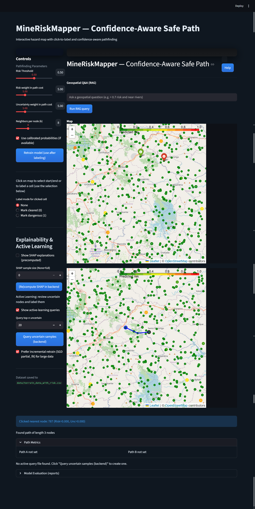

# MineMind - Mine Risk Mapper

**MineMind** is a prototype AI-driven geospatial tool for visualizing predicted mine-related hazard risks across terrain and planning safer traversal routes that account for both predicted risk and model uncertainty. It integrates predictive modeling, explainability (SHAP), and active learning into an interactive Streamlit interface for analysts, NGOs, and researchers.

Impact: MineMind provides a practical, human-in-the-loop environment for exploring model-driven risk maps, generating confidence-aware routes, and iteratively improving models via human labels and active learning.

---

## Highlights

* Interactive map-driven workflow combining predicted risk and model uncertainty.
* Confidence-aware pathfinding using a KDTree + NetworkX graph and weighted shortest-path search.
* Explainability via SHAP: per-node and global feature contributions to predicted risk.
* Lightweight background job queue to offload heavy tasks (SHAP, active-learning queries, retraining).
* Geospatial mini-RAG helper for constrained queries (e.g., ">0.7 risk and near rivers").

---

## Key Features

* Click-to-select start and end nodes (snap-to-nearest) and compute lowest-risk path.
* Labeling mode to append human labels to `data/labels_delta.csv` for retraining.
* Save/Compare (Path A vs Path B) to explore tradeoffs between risk and uncertainty weights.
* SHAP explainability: global mean |SHAP| summaries and per-node contributions for inspection.
* Active learning pipeline: query top‑N uncertain samples, label them in the UI, and retrain.
* Background job system: enqueue heavy tasks and inspect logs from `/jobs/`.

---


---

## Tech Stack

Frontend:

- Streamlit — Interactive UI and visualization
- Folium + streamlit-folium — Leaflet-based geospatial map rendering
- Embedded HTML/CSS — UI styling and card layouts

Backend & ML:

- Python 3.11
- scikit-learn — baseline risk prediction models
- SHAP — explainability for model outputs
- imbalanced-learn — SMOTE/resampling for class imbalance experiments
- NetworkX — graph construction and weighted shortest-paths
- GeoPandas + Shapely — geospatial feature engineering and CRS transforms
- joblib / pickle — model persistence
- Custom filesystem-backed job queue + worker for background tasks

Data & Storage:

- CSV and GeoJSON files under `data/`
- Model artifacts and SHAP outputs under `models/`
- Evaluation reports under `reports/`

---

## Quickstart (Windows PowerShell)

1. Activate the project virtual environment:

```powershell
C:\Users\harsh\desktop\MineMind\mrvenv\Scripts\Activate.ps1
```

2. Install dependencies:

```powershell
pip install -r requirements.txt
```

3. (Optional) Start the background worker in a separate terminal (recommended for SHAP & active learning):

```powershell
python backend\worker.py
```

4. Launch the Streamlit frontend:

```powershell
mrvenv\Scripts\python.exe -m streamlit run frontend\app.py
```

Open the URL printed by Streamlit (usually http://localhost:8501).

---

## Example outputs

The app and backend scripts produce the following artifacts:

- `data/terrain_data_with_risk.csv` — dataset augmented with `risk` and `uncertainty` columns
- `data/labels_delta.csv` — appended human labels (index,label)
- `models/` — saved models, calibrated models, and SHAP artifacts (`shap_values.npy`, `shap_summary.json`)
- `reports/` — evaluation plots (ROC, PR, calibration) and `metrics.json`
- `jobs/<job_id>/log.txt` and `jobs/<job_id>/job.json` — background job logs and metadata

---

---

## Architecture & Design

High-level components:

- Frontend (`frontend/app.py`): Streamlit UI that loads geodata, shows map, and provides controls for labeling, SHAP, active learning, and path comparison.
- Graph builder: projects points to Web Mercator (EPSG:3857), builds a KDTree for nearest-neighbour queries and a NetworkX graph for routing. Edge weights combine distance, predicted risk, and uncertainty.
- Model pipeline: preprocessing, baseline training, optional calibration, and persistence to `models/`.
- SHAP helper (`backend/shap_explain.py`): computes SHAP values and writes artifacts used by the UI.
- Active learning helper (`backend/active_learning.py`): selects top‑N uncertain nodes and supports incremental retraining using `data/labels_delta.csv`.
- Job queue & worker (`backend/job_queue.py`, `backend/worker.py`): filesystem-backed queue for non-blocking compute jobs.

---

## Reproducing experiments

Typical sequence to reproduce training and evaluation artifacts:

```powershell
# Activate env
mrvenv\Scripts\Activate.ps1

# Preprocess
python backend\preprocess.py

# Train baselines & produce evaluation reports
python backend\train_baselines.py

# Generate operating points
python backend\operating_points.py

# Compute SHAP (optional, via worker)
python backend\worker.py  # in separate terminal
python backend\shap_explain.py --sample-size 100

# Launch frontend
streamlit run frontend\app.py
```

---

## Future enhancements

- Integrate satellite imagery layers (Sentinel-2 / Google Earth Engine).
- Deploy a multi-user production variant using a proper backend (FastAPI) and a managed queue (Redis + Celery).
- Add automatic model versioning and experiment tracking (MLflow / DVC).
